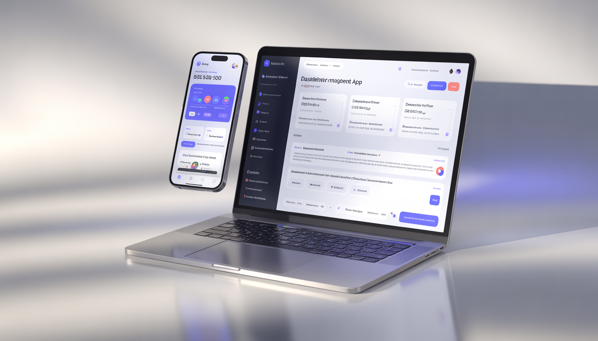
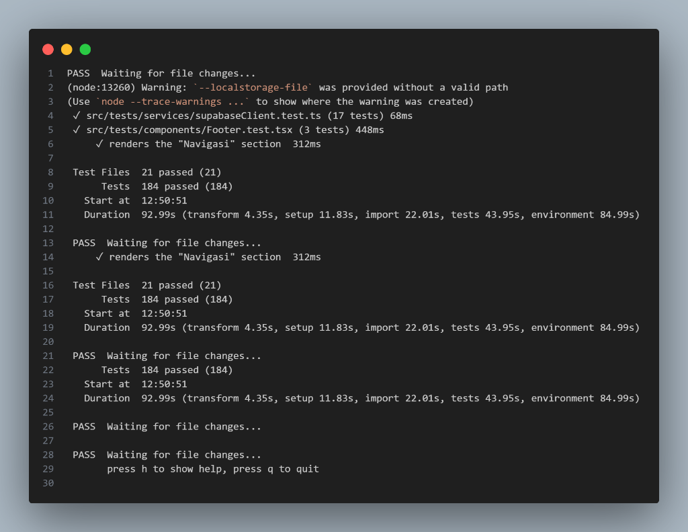
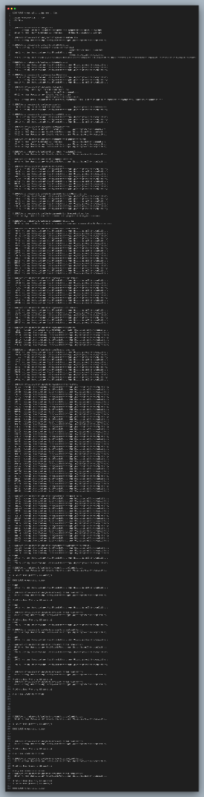
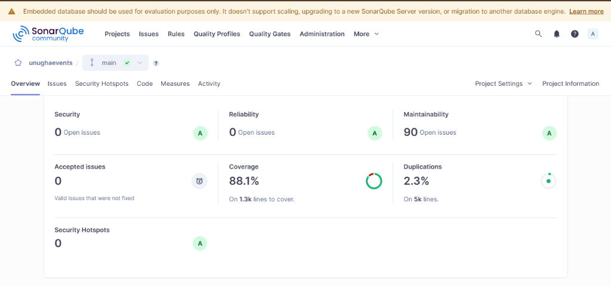

# ✨ UNUGHA Event Platform

  

  

  
  
  
  

  
  
  

---

## 📚 Overview
**UNUGHA Event Platform** adalah platform manajemen acara kampus modern yang dirancang untuk menyederhanakan kolaborasi antar mahasiswa dan organisasi di lingkungan Universitas Nahdlatul Ulama Al Ghazali. Proyek ini dikembangkan sebagai tugas akhir mata kuliah **Analisis & Pengujian Sistem (IF7A)**, dengan fokus utama pada kualitas kode, keandalan fungsional, dan pengujian sistem yang komprehensif.

---

## 👥 Tim Pengembang
| Role | Nama | NIM |
|-------|------|-----|
| **Project Leader** | **Ma’ruf Muchlisin** | 22EO10013 |
| **QA Engineer** | Akmal Ubaidillah | 22EO10013 |
| **Fullstack Dev** | Eko Patrio | 22EO10013 |

---

## 🚀 Fitur Utama
- **🔐 Secure Authentication**: Sistem login & registrasi terintegrasi dengan Supabase Auth.
- **📅 Interactive Calendar**: Visualisasi jadwal event kampus yang dinamis.
- **🛠 Event Management**: Full CRUD (Create, Read, Update, Delete) untuk pengelolaan event.
- **👤 Profile Personalization**: Pengaturan profil pengguna, bio, dan unggah foto avatar.
- **⚙️ Simulation**: Generator data dummy untuk pengujian skala besar.
- **📱 Responsive Design**: Antarmuka premium yang dioptimalkan untuk perangkat mobile dan desktop.

---

## 🧪 Quality Assurance & Testing
Proyek ini mengimplementasikan strategi pengujian berlapis untuk memastikan stabilitas sistem:

### 1. Unit Testing
- Menggunakan **Vitest** dan **React Testing Library**.
- Mencakup pengujian komponen UI, hooks, dan utilitas logic.
- **Total Tests**: `> 160 Passed`.

### 2. Integration Testing

- Pengujian alur kerja antar komponen (misal: Alur Login hingga masuk Dashboard).
- Pengujian integrasi layanan pihak ketiga (Supabase Mocking).

#### 🧪 Unit & Integration Test Result:

  

### 3. Static Code Analysis

- **SonarQube**: Digunakan untuk navigasi technical debt, mendeteksi code smells, dan kerentanan keamanan.
- **ESLint**: Penegakan standar penulisan kode TypeScript yang ketat.

#### 🔍 Lint Analysis Result (ESLint):

  

#### 📊 SonarQube Analysis Result:

  

### 4. CI/CD Pipeline
- **GitHub Actions**: Setiap push ke branch `main` akan memicu pipeline otomatis yang melakukan instalasi deps, linting, dan menjalankan seluruh suite pengujian.

---

## 🛠 Tech Stack
- **Frontend**: React 19 (Vite), Tailwind CSS, Lucide Icons.
- **Backend & Database**: Supabase (PostgreSQL), Supabase Storage.
- **Testing**: Vitest, React Testing Library.
- **Analysis**: SonarQube, ESLint.

---

## 🏁 Cara Menjalankan
1. Clone repositori ini.
2. Install dependensi: `npm install`.
3. Jalankan development server: `npm run dev`.
4. Jalankan pengujian: `npm test`.
5. Lihat laporan cakupan kode: `npm run coverage`.

---

  <b>Dibuat dengan ❤️ oleh Tim Ma'ruf Muchlisin</b> 
  <i>"Quality is not an act, it is a habit."</i>

  

